# AI-BOX Box System 架构设计文档（Agent 版）

> **版本**: 1.0.0
> **日期**: 2026-03-10
> **状态**: 最终版（经 Arch1/Arch2/CTO/CPO 四角色评审）
> **适用读者**: 实现者 Agent、测试者、代码审查者
> **数据来源**: 全量源码交叉验证 + PRD 规格文档 + 架构评审决议

---

## 目录

1. [架构概述与设计原则](#1-架构概述与设计原则)
2. [逻辑架构](#2-逻辑架构)
3. [模块划分与依赖](#3-模块划分与依赖)
4. [部署拓扑](#4-部署拓扑)
5. [网络架构](#5-网络架构)
6. [存储架构](#6-存储架构)
7. [安全架构](#7-安全架构)
8. [核心时序图](#8-核心时序图)
9. [状态机设计](#9-状态机设计)
10. [API 接口规范](#10-api-接口规范)
11. [数据流架构](#11-数据流架构)
12. [资源规划](#12-资源规划)
13. [可靠性设计](#13-可靠性设计)
14. [运维设计](#14-运维设计)
15. [已知问题与改进计划](#15-已知问题与改进计划)
16. [扩展设计（多 Box 联邦）](#16-扩展设计多-box-联邦)
17. [架构决策记录（ADR）](#17-架构决策记录adr)
18. [附录](#18-附录)

---

## 1. 架构概述与设计原则

### 1.1 系统定位

AI-BOX Box System 是部署在每台 AI-BOX 物理设备（Mac Mini 形态，运行 Ubuntu Linux）上的**单机一体化管理系统**。它不依赖外部数据库、消息队列或微服务基础设施，所有组件在同一台物理机上以进程方式运行。系统为企业 AI 开发团队提供开箱即用的 Claude Code 开发环境管理能力——从创建 Linux 用户、配置 AI 模型凭据、安装 VS Code Server 到 OAuth 认证授权，全部通过 5 步向导在 10 分钟内完成。

### 1.2 设计约束

| 约束维度 | 具体约束 | 源码依据 |
|----------|----------|----------|
| 部署形态 | 单机部署，运行在 AI-BOX 物理设备（Mac Mini 形态，x86_64 Ubuntu 22.04+） | `deploy/install.sh` L8-L9 |
| 网络环境 | 企业内网环境，Box 设备位于内网，需代理访问外网 | `src/backend/src/routes/git.ts` 三策略代理回退 |
| 离线优先 | VS Code Server 从本地资源包部署；SQLite 嵌入式数据库零外部依赖 | `src/backend/src/services/vscode-server.ts`, `src/backend/src/db/connection.ts` |
| 单进程 | Fastify HTTP 服务 + WebSocket 服务运行在同一 Node.js 进程 | `src/backend/src/server.ts` L40-L156 |
| 运行用户 | 后端以 `boxsystem` 系统用户运行，通过 `sudo` 执行特权操作 | `src/backend/src/services/config.ts` L32, `deploy/install.sh` L38 |
| 并发规模 | 支持 10-50 个管理员同时使用 | PRD 非功能性需求 |

### 1.3 核心设计原则

| 编号 | 原则 | 说明 | 体现 |
|------|------|------|------|
| P1 | **单机一体化** | 所有组件（Web 服务、数据库、文件存储、守护进程）运行在同一台物理机上 | 消除网络分区和分布式一致性复杂性 |
| P2 | **PAM 统一认证** | 不在应用数据库中存储密码哈希，所有密码认证委托给 Linux PAM | `src/backend/src/services/pam-auth.ts` |
| P3 | **加密存储敏感数据** | API Key、密码等使用 AES-256-GCM 加密后存入数据库，API 响应不返回原文 | `src/backend/src/services/crypto.ts` |
| P4 | **进程隔离** | Box System (boxsystem 用户) 和 aibox-daemon (aibox-daemon 用户) 通过 HTTP API 通信 | 一个进程崩溃不影响另一个 |
| P5 | **Fire-and-forget 异步模式** | VS Code 安装、CLAUDE.md 生成、deploy.yaml 生成等不阻塞 HTTP 响应 | `src/backend/src/routes/users.ts` L171-L181 |
| P6 | **系统用户双写** | 应用层用户操作同步到 Linux 系统用户，失败时回滚数据库 | `src/backend/src/routes/users.ts` L157-L161 |
| P7 | **命令注入防护** | 全系统使用 `execFile`（参数数组）替代 `exec`（字符串拼接） | `src/backend/src/services/system-user.ts` L56 |
| P8 | **最小权限原则** | RBAC 三级角色权限，Daemon API 仅限本地调用 + Token 认证 | `src/backend/src/middleware/auth.ts` |
| P9 | **数据本地化** | 所有持久数据（SQLite、凭据文件、VS Code 安装）存储在本地文件系统 | 不依赖网络存储 |
| P10 | **离线优先** | 核心功能（用户管理、凭据管理、VS Code 安装）均可在无公网环境下工作 | VS Code 从本地预打包资源安装 |

---

## 2. 逻辑架构

### 2.1 分层架构图

```mermaid
graph TB
    subgraph ClientLayer["CLIENT LAYER (浏览器)"]
        React["React 18 SPA"]
        Zustand["Zustand Store"]
        APIService["API Service (fetch+JWT)"]
    end

    subgraph GatewayLayer["GATEWAY LAYER (接入层)"]
        Fastify["Fastify 5 HTTP :3010"]
        WSServer["WebSocket Server :3011"]
        Nginx["Nginx :80 (反向代理)"]
    end

    subgraph MiddlewareLayer["MIDDLEWARE LAYER (中间件层)"]
        AuthMW["authMiddleware (JWT)"]
        AdminMW["adminOnly (角色检查)"]
        DaemonMW["daemonAuthMiddleware (localhost+Token)"]
    end

    subgraph RouteLayer["ROUTE LAYER (14 路由模块)"]
        Auth["auth"]
        Users["users"]
        Models["models"]
        Teams["teams"]
        Deploy["deploy"]
        Repos["repos"]
        Agents["agents"]
        System["system"]
        SSH["ssh"]
        Git["git"]
        Daemon["daemon"]
        ClaudeAuth["claude-auth"]
        VSCode["vscode-server"]
        SSHKeys["user-ssh-keys"]
    end

    subgraph ServiceLayer["SERVICE LAYER (15 服务模块)"]
        PamAuth["pam-auth"]
        SystemUser["system-user"]
        Crypto["crypto (AES-256)"]
        ClaudeAuthSvc["claude-auth (PKCE)"]
        AgentMgr["agent-manager"]
        LLMGateway["llm-gateway"]
        DaemonSvc["daemon (Root)"]
        VSCodeSvc["vscode-server"]
        WSHub["ws-hub"]
        EventLogger["event-logger"]
        ClaudeMdGen["claude-md-generator"]
        DeployYamlGen["deploy-yaml-generator"]
        Config["config"]
        Logger["logger (pino)"]
        DaemonDB["daemon-db (只读)"]
    end

    subgraph DataLayer["DATA LAYER (数据层)"]
        SQLite["SQLite (better-sqlite3)\nWAL 模式 + FK 约束\n10 张业务表 + 1 迁移表\nsrc/backend/data/swt.db"]
        DaemonDBFile["Daemon DB (只读)\n/var/lib/aibox-daemon/aibox.db\n表: managed_users, device_config"]
    end

    subgraph OSLayer["OS LAYER (操作系统层)"]
        PAM["Linux PAM"]
        UserMgmt["useradd/chpasswd/userdel"]
        Sudo["sudo 特权操作"]
        FileSystem["文件系统 (~/.claude/, ~/.ssh/)"]
        ShellScripts["Shell 脚本 (vscode-install, claude-md, deploy-yaml)"]
    end

    ClientLayer --> GatewayLayer
    GatewayLayer --> MiddlewareLayer
    MiddlewareLayer --> RouteLayer
    RouteLayer --> ServiceLayer
    ServiceLayer --> DataLayer
    ServiceLayer --> OSLayer
```

### 2.2 各层职责

| 层次 | 职责 | 关键文件 |
|------|------|----------|
| Client Layer | React SPA，Zustand 状态管理，fetch API 封装，JWT 自动注入 | `src/frontend/src/App.tsx`, `src/frontend/src/store/wizardStore.ts`, `src/frontend/src/services/api.ts` |
| Gateway Layer | HTTP 请求接入、CORS 处理、静态文件服务、WebSocket 连接管理 | `src/backend/src/server.ts` |
| Middleware Layer | JWT 认证、角色鉴权、Daemon Token 时序安全校验 | `src/backend/src/middleware/auth.ts` |
| Route Layer | 14 个路由模块，请求参数校验，业务逻辑编排，响应格式化 | `src/backend/src/routes/*.ts` |
| Service Layer | 15 个服务模块，核心业务逻辑实现，外部系统交互封装 | `src/backend/src/services/*.ts` |
| Data Layer | SQLite 数据库（本地读写）+ Daemon DB（只读），迁移系统 | `src/backend/src/db/connection.ts`, `src/backend/src/db/schema.sql`, `src/backend/src/services/daemon-db.ts` |
| OS Layer | Linux 系统用户管理、PAM 认证、文件系统操作、Shell 脚本调用 | `src/backend/src/services/system-user.ts`, `src/backend/src/services/pam-auth.ts` |

### 2.3 层间依赖关系

```
Client Layer ──HTTP/WS──> Gateway Layer
Gateway Layer ──preHandler──> Middleware Layer
Gateway Layer ──register──> Route Layer
Route Layer ──import──> Service Layer
Route Layer ──import──> Data Layer (直接 SQL 查询)
Service Layer ──import──> Data Layer
Service Layer ──execFile/spawn──> OS Layer
Service Layer ──import──> Service Layer (横向依赖：event-logger, ws-hub, crypto)
```

**关键约束**: Route Layer 既调用 Service Layer，也直接访问 Data Layer（SQL 查询）。Service Layer 之间存在横向依赖（如 agent-manager 依赖 ws-hub 和 event-logger）。

---

## 3. 模块划分与依赖

### 3.1 五大业务模块

#### M1: 身份与认证模块

**职责**: 管理用户身份认证、JWT 令牌生命周期、角色授权、Daemon API 认证

| 组件 | 源码路径 | 职责 |
|------|----------|------|
| auth routes | `src/backend/src/routes/auth.ts` | 登录端点（三级查找链）、Token 刷新 |
| auth middleware | `src/backend/src/middleware/auth.ts` | JWT 验证、角色检查、Daemon Token 校验 |
| pam-auth service | `src/backend/src/services/pam-auth.ts` | PAM 认证封装（原生模块优先，回退 su -c true） |
| daemon-db service | `src/backend/src/services/daemon-db.ts` | 只读访问 aibox-daemon 数据库 |
| config service | `src/backend/src/services/config.ts` | JWT_SECRET, FACTORY_USER, DAEMON_TOKEN 等配置 |

**对外接口**:

| 端点 | 方法 | 认证 | 说明 |
|------|------|------|------|
| `/api/v1/auth/login` | POST | 无 | 登录，返回 JWT |
| `/api/v1/auth/refresh` | POST | JWT | 刷新令牌 |

#### M2: 开发环境模块

**职责**: Claude Code OAuth PKCE 认证代理、VS Code Server 安装管理

| 组件 | 源码路径 | 职责 |
|------|----------|------|
| claude-auth routes | `src/backend/src/routes/claude-auth.ts` | 6 个 OAuth PKCE 端点 |
| claude-auth service | `src/backend/src/services/claude-auth.ts` | PKCE 会话管理（内存 Map）、Token 交换、凭据文件写入 |
| vscode-server routes | `src/backend/src/routes/vscode-server.ts` | 安装/重装/状态查询端点 |
| vscode-server service | `src/backend/src/services/vscode-server.ts` | 调用 vscode-cc-plugin-install.sh 脚本，并发锁，进度跟踪 |

**对外接口**:

| 端点 | 方法 | 说明 |
|------|------|------|
| `/api/v1/users/:id/claude-auth/login/start` | POST | 生成 PKCE session + OAuth URL |
| `/api/v1/users/:id/claude-auth/login/submit-code` | POST | 提交授权码，交换 Token |
| `/api/v1/users/:id/claude-auth/login/status` | GET | 查询会话状态 |
| `/api/v1/users/:id/claude-auth/login/cancel` | POST | 取消会话 |
| `/api/v1/users/:id/claude-auth/status` | GET | 检查磁盘凭证文件 |
| `/api/v1/users/:id/claude-auth/logout` | POST | 删除凭证文件 |
| `/api/v1/users/:id/vscode-server/status` | GET | 安装状态和版本 |
| `/api/v1/users/:id/vscode-server/reinstall` | POST | 强制重装 |
| `/api/v1/users/:id/vscode-server/install-progress` | GET | 安装进度 |

**内存状态**:
- `sessions: Map<string, ClaudeAuthSession>` - OAuth PKCE 会话，60 秒清理周期
- `installLocks: Set<string>` - VS Code 安装并发锁
- `installProgress: Map<string, InstallProgressEntry>` - 安装进度跟踪

#### M3: 配置管理模块

**职责**: 模型凭据 CRUD、团队编排、部署配置、Git 仓库配置、SSH 密钥管理

| 组件 | 源码路径 | 职责 |
|------|----------|------|
| models routes | `src/backend/src/routes/models.ts` | 模型凭据 CRUD + verify(Mock) |
| teams routes | `src/backend/src/routes/teams.ts` | 团队 CRUD + launch/stop |
| deploy routes | `src/backend/src/routes/deploy.ts` | 部署配置 CRUD + test-connection(Mock) |
| repos routes | `src/backend/src/routes/repos.ts` | 仓库配置 CRUD + test(Mock) |
| ssh routes | `src/backend/src/routes/ssh.ts` | 系统级 SSH 密钥生成、GitHub 操作 |
| git routes | `src/backend/src/routes/git.ts` | HTTPS git ls-remote（三策略代理回退） |
| user-ssh-keys routes | `src/backend/src/routes/user-ssh-keys.ts` | 用户级 SSH 公钥 CRUD |
| crypto service | `src/backend/src/services/crypto.ts` | AES-256-GCM 加密/解密 |
| claude-md-generator | `src/backend/src/services/claude-md-generator.ts` | 团队变更时生成 CLAUDE.md |
| deploy-yaml-generator | `src/backend/src/services/deploy-yaml-generator.ts` | 云端部署时生成 deploy.yaml |

**对外接口**:

| 模块 | 端点前缀 | 端点数 | 说明 |
|------|----------|--------|------|
| 模型凭据 | `/api/v1/models` | 5 | CRUD + verify(Mock) |
| 团队配置 | `/api/v1/teams` | 6 | CRUD + launch/stop |
| 部署配置 | `/api/v1/deploy` | 5 | CRUD + test-connection(Mock) |
| Git 仓库 | `/api/v1/repos` | 5 | CRUD + test(Mock) |
| SSH (系统) | `/api/v1/ssh` | 6 | 密钥生成、GitHub 集成 |
| Git (HTTPS) | `/api/v1/git` | 1 | ls-remote |
| SSH (用户) | `/api/v1/users/:id/ssh-keys` | 3 | 公钥 CRUD |

#### M4: Agent 运行时模块

**职责**: Agent 实例生命周期管理、LLM 请求网关、WebSocket 事件推送

| 组件 | 源码路径 | 职责 |
|------|----------|------|
| agents routes | `src/backend/src/routes/agents.ts` | Agent 查询/恢复/停止/日志/superpowers |
| agent-manager service | `src/backend/src/services/agent-manager.ts` | 状态流转、熔断机制（3 次错误自动挂起）、事件记录 |
| llm-gateway service | `src/backend/src/services/llm-gateway.ts` | MoE 路由策略、滑动窗口限流、请求队列、指数退避重试 |
| ws-hub service | `src/backend/src/services/ws-hub.ts` | WebSocket Hub、认证、订阅、广播 |

**对外接口**:

| 端点 | 方法 | 说明 |
|------|------|------|
| `/api/v1/agents` | GET | 查询 Agent 列表 |
| `/api/v1/agents/:id` | GET | 查询 Agent 详情（含 superpowers） |
| `/api/v1/agents/:id/resume` | POST | 恢复 Agent |
| `/api/v1/agents/:id/stop` | POST | 停止 Agent |
| `/api/v1/agents/:id/logs` | GET | 分页查询日志 |
| `/api/v1/agents/:id/superpowers` | PUT | upsert superpowers |

#### M5: 系统运维模块

**职责**: 用户管理（含级联删除）、资源监控、系统事件日志、Daemon 内部 API、Root Daemon 后台任务

| 组件 | 源码路径 | 职责 |
|------|----------|------|
| users routes | `src/backend/src/routes/users.ts` | 用户 CRUD + ensure + 级联删除 |
| system routes | `src/backend/src/routes/system.ts` | 健康检查 / 资源监控 / 事件日志 |
| daemon routes | `src/backend/src/routes/daemon.ts` | Daemon 内部 API（9 个端点） |
| system-user service | `src/backend/src/services/system-user.ts` | Linux 用户 CRUD、SSH 密钥部署 |
| daemon service | `src/backend/src/services/daemon.ts` | Root Daemon：资源监控、心跳检测、网络监测、紧急冻结 |
| event-logger service | `src/backend/src/services/event-logger.ts` | system_events 表写入 |
| logger service | `src/backend/src/services/logger.ts` | pino 日志（stdout + 文件） |

**对外接口**:

| 端点前缀 | 端点数 | 认证方式 | 说明 |
|----------|--------|----------|------|
| `/api/v1/users` | 6 | JWT (admin) | 用户 CRUD + ensure |
| `/api/v1/system` | 3 | 公开/JWT | 健康/资源/事件 |
| `/api/v1/daemon` | 9 | Daemon Token | 内部 API |

### 3.2 模块依赖 DAG

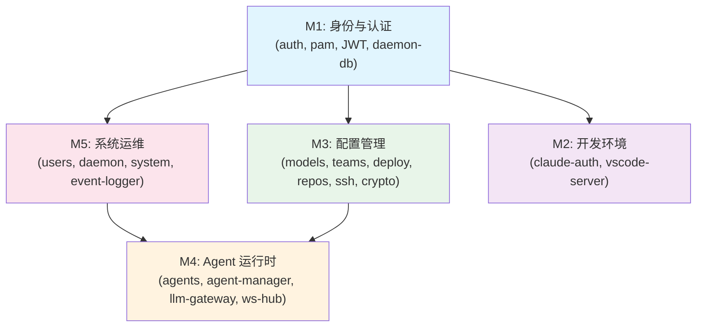

**依赖方向分析**:

| 被依赖方 | 依赖方 | 依赖类型 |
|----------|--------|----------|
| M1 (auth) | M2, M3, M4, M5 | 所有模块依赖 M1 的 authMiddleware |
| M5 (event-logger) | M4 (agent-manager, llm-gateway, daemon) | 事件记录 |
| M4 (ws-hub) | M4 (agent-manager, llm-gateway), M5 (daemon) | 广播事件 |
| M3 (crypto) | M3 (models, deploy, repos) | 加密存储 |
| M5 (system-user) | M5 (users, daemon routes) | Linux 用户操作 |

**循环依赖检测**: 无循环依赖。M4 和 M5 之间存在间接耦合（通过 agent_instances 表共享状态），非代码层直接依赖。

---

## 4. 部署拓扑

### 4.1 四层部署架构

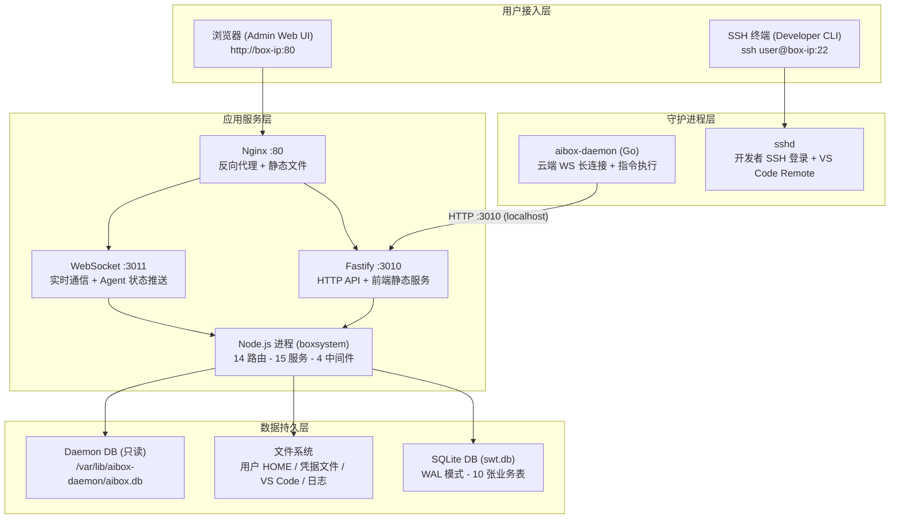

### 4.2 完整进程清单

| 进程名 | 运行用户 | 管理方式 | 端口 | 职责 |
|-------|---------|---------|------|------|
| `node dist/server.js` | boxsystem | systemd (`aibox-box-system`) | 3010, 3011 | Box System 主进程：HTTP API + WebSocket + 前端静态文件服务 |
| `nginx` | www-data | systemd (`nginx`) | 80 | 反向代理，SPA 路由回退，静态文件缓存 |
| `aibox-daemon` | aibox-daemon | systemd (`aibox-daemon`) | 无外部端口 | 云端通信守护进程，通过 WS 连接云端管理台 |
| `sshd` | root | systemd (`ssh`) | 22 | SSH 服务，供开发者远程登录和 VS Code Remote SSH |

### 4.3 systemd 服务配置

#### aibox-box-system.service

```ini
[Unit]
Description=AI-BOX Box-System Backend
Documentation=https://code.iflytek.com/ZHBG_ZS_YFB/ZS_AIPC/AI-Box
After=network.target

[Service]
Type=simple
User=boxsystem
Group=boxsystem
WorkingDirectory=/opt/aibox/box-system/src/backend
ExecStart=/usr/bin/node dist/server.js
Restart=on-failure
RestartSec=5
StandardOutput=journal
StandardError=journal
Environment=NODE_ENV=production
NoNewPrivileges=false
ProtectSystem=false

[Install]
WantedBy=multi-user.target
```

关键配置说明:
- `Restart=on-failure` + `RestartSec=5`：异常退出后 5 秒自动重启
- `User=boxsystem`：非 root 专用服务账号
- `NoNewPrivileges=false`：因为 boxsystem 需要通过 sudo 执行系统用户管理命令

#### aibox-daemon.service

```ini
[Unit]
Description=AIBox Daemon - SuperTeam Wizard Box Agent
After=network-online.target
Wants=network-online.target

[Service]
Type=simple
User=aibox-daemon
Group=aibox-daemon
ExecStart=/usr/local/bin/aibox-daemon --config /etc/aibox-daemon/config.yaml
Restart=always
RestartSec=5
StartLimitIntervalSec=0
NoNewPrivileges=false
ProtectSystem=strict
ProtectHome=read-only
ReadWritePaths=/var/lib/aibox-daemon /var/log/aibox-daemon
MemoryMax=256M
CPUQuota=20%

[Install]
WantedBy=multi-user.target
```

### 4.4 目录结构设计

```
/opt/aibox/
├── box-system/                          # INSTALL_DIR - 主应用目录
│   ├── package.json                     # 根 monorepo 配置
│   ├── pnpm-workspace.yaml             # pnpm 工作空间定义
│   ├── pnpm-lock.yaml                  # 依赖锁文件
│   ├── node_modules/                   # 根级依赖
│   ├── src/
│   │   ├── backend/                    # 后端应用
│   │   │   ├── package.json
│   │   │   ├── tsconfig.json
│   │   │   ├── .env                    # 环境变量配置 (chmod 600)
│   │   │   ├── node_modules/           # 后端依赖 (含 better-sqlite3 等原生模块)
│   │   │   ├── src/                    # TypeScript 源码
│   │   │   │   ├── server.ts           # 入口文件
│   │   │   │   ├── routes/             # 14 个路由模块
│   │   │   │   ├── services/           # 15 个服务模块
│   │   │   │   ├── middleware/         # 认证中间件
│   │   │   │   ├── db/                 # 数据库连接和迁移
│   │   │   │   │   ├── connection.ts   # SQLite 连接管理 (单例)
│   │   │   │   │   ├── schema.sql      # 表结构定义
│   │   │   │   │   └── migrate.ts      # 迁移引擎
│   │   │   │   └── types/              # TypeScript 类型定义
│   │   │   ├── dist/                   # 编译产物
│   │   │   │   └── server.js           # systemd ExecStart 入口
│   │   │   └── data/                   # 运行时数据目录
│   │   │       ├── swt.db              # SQLite 主数据库
│   │   │       ├── swt.db-wal          # WAL 日志
│   │   │       ├── swt.db-shm         # 共享内存映射
│   │   │       └── logs/
│   │   │           └── app.log         # pino 应用日志
│   │   └── frontend/                   # 前端应用
│   │       ├── package.json
│   │       ├── vite.config.ts
│   │       ├── src/                    # React 源码
│   │       └── dist/                   # Vite 构建产物
│   │           ├── index.html          # SPA 入口
│   │           └── assets/             # 静态资源 (JS/CSS/字体)
│   └── assets/                         # 部署资源包
│       ├── vscode-server/
│       ├── subagent/
│       └── deploy/
├── vscode-server/                      # VS Code Server 资源独立目录
├── subagent/                           # Subagent 脚本独立目录
└── deploy-scripts/                     # 部署脚本独立目录
```

### 4.5 用户 HOME 目录结构

每个由 Box System 创建的开发者用户，其 HOME 目录遵循以下结构：

```
/home/<username>/
├── .ssh/                              # SSH 配置 (chmod 700)
│   └── authorized_keys                # SSH 公钥 (chmod 600)
├── .bashrc                            # 包含 CLAUDE_CODE_EXPERIMENTAL_AGENT_TEAMS=1
├── .claude/                           # Claude Code 配置目录
│   ├── .credentials.json              # OAuth 凭据 (chmod 600, owner-only)
│   ├── .claude.json                   # Claude Code CLI 配置 (冗余副本)
│   ├── session-env/                   # Claude Code 会话环境缓存
│   └── deploy.yaml                    # 部署配置
├── .claude.json                       # Claude Code CLI 主配置
├── .vscode-server/                    # VS Code Remote SSH Server 安装目录
│   ├── code-<commitId>                # VS Code Server 可执行文件
│   ├── bin/<commitId>/                # 旧版布局 (兼容)
│   └── extensions/
│       └── anthropic.claude-code-*/   # Claude Code 插件
├── workspace/                         # 默认工作空间目录
└── CLAUDE.md                          # Agent 团队配置文件
```

### 4.6 系统用户与用户组

| 用户/组 | 类型 | 创建方式 | 用途 |
|--------|------|---------|------|
| `boxsystem` | 系统用户 | `install.sh` 创建，`-r -s /usr/sbin/nologin` | Box System 服务运行用户 |
| `aibox-daemon` | 系统用户 | aibox-daemon 安装脚本创建 | 守护进程运行用户 |
| `aiboxadmin` | 管理员用户 | 出厂预设或手动创建 | 超级管理员，默认密码 `changeme123` |
| `aibox` | 用户组 | `install.sh` 创建 | 所有开发者用户的主组 |
| `aibox-admin` | 用户组 | `install.sh` 创建 | 管理员附加组 |
| `<developer>` | 普通用户 | 运行时由 Box System API 创建 | 开发者用户，属组 `aibox` |

---

## 5. 网络架构

### 5.1 网络拓扑

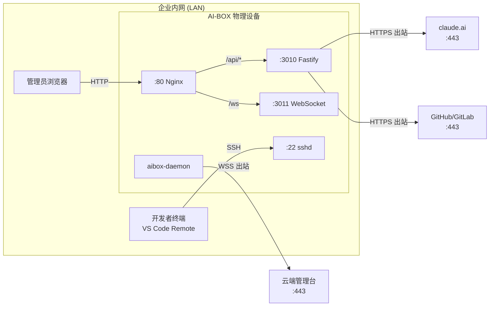

### 5.2 端口矩阵

#### 入站端口

| 端口 | 协议 | 服务 | 监听地址 | 用途 | 认证方式 |
|------|------|------|---------|------|---------|
| 22 | TCP/SSH | sshd | 0.0.0.0 | 开发者远程登录 + VS Code Remote SSH | SSH 密钥/密码 |
| 80 | TCP/HTTP | Nginx | 0.0.0.0 | 管理 Web UI + API 反向代理 | 无/JWT |
| 3010 | TCP/HTTP | Fastify | 0.0.0.0 | 后端 HTTP API（建议生产环境 127.0.0.1） | JWT/Daemon Token |
| 3011 | TCP/WS | ws | 0.0.0.0 | WebSocket 实时通信（建议生产环境 127.0.0.1） | JWT |

#### 出站端口

| 目标 | 端口 | 协议 | 发起者 | 用途 | 必要性 |
|------|------|------|-------|------|-------|
| claude.ai / platform.claude.com | 443 | HTTPS | Fastify | OAuth PKCE Token 交换 | 认证时必需 |
| api.superteam.com | 443 | WSS | aibox-daemon | 云端管理台长连接 | 云端管理时必需 |
| github.com / gitlab / gitee | 443 | HTTPS | Fastify | git ls-remote 仓库验证 | 配置 Git 仓库时必需 |
| deb.nodesource.com / npmjs.org | 443 | HTTPS | install.sh | 安装阶段下载依赖 | 仅安装时需要 |
| dns.google | 53 | UDP/DNS | Fastify (daemon.ts) | 网络连通性检测 | 监控功能 |

### 5.3 Nginx 反向代理配置

```nginx
server {
    listen 80;
    server_name _;

    # ---- 前端静态文件 ----
    root /opt/aibox/box-system/src/frontend/dist;
    index index.html;

    location / {
        try_files $uri $uri/ /index.html;
    }

    # ---- 后端 API 代理 ----
    location /api/ {
        proxy_pass http://127.0.0.1:3010;
        proxy_http_version 1.1;
        proxy_set_header Host $host;
        proxy_set_header X-Real-IP $remote_addr;
        proxy_set_header X-Forwarded-For $proxy_add_x_forwarded_for;
        proxy_set_header X-Forwarded-Proto $scheme;
        proxy_connect_timeout 30;
        proxy_send_timeout 60;
        proxy_read_timeout 60;
    }

    # ---- WebSocket 代理 ----
    location /ws {
        proxy_pass http://127.0.0.1:3011;
        proxy_http_version 1.1;
        proxy_set_header Upgrade $http_upgrade;
        proxy_set_header Connection "upgrade";
        proxy_set_header Host $host;
        proxy_set_header X-Real-IP $remote_addr;
        proxy_read_timeout 3600s;
        proxy_send_timeout 3600s;
    }
}
```

### 5.4 通信矩阵

#### 进程间通信

| 发起方 | 接收方 | 协议 | 路径 | 认证 |
|-------|-------|------|------|------|
| Nginx | Fastify | HTTP | /api/* -> 127.0.0.1:3010 | 透传客户端认证头 |
| Nginx | WebSocket Server | WS | /ws -> 127.0.0.1:3011 | 连接后 JWT 认证 |
| aibox-daemon | Fastify | HTTP | /api/v1/daemon/* -> 127.0.0.1:3010 | X-Daemon-Token + localhost |
| Fastify | aibox-daemon SQLite | 文件 I/O | /var/lib/aibox-daemon/aibox.db | 只读打开 |
| Fastify | Linux 内核 | sudo 子进程 | useradd / chpasswd / userdel 等 | sudoers 白名单 |
| Fastify | 安装脚本 | sudo 子进程 | vscode-cc-plugin-install.sh | 以 root 运行 |
| Fastify | 生成脚本 | sudo 子进程 | generate-claude-md.sh | 以目标用户运行 |

#### 与外部系统通信

| 发起方 | 目标系统 | 协议 | 用途 | 频率 |
|-------|---------|------|------|------|
| Fastify | platform.claude.com | HTTPS POST | OAuth Token 交换 | 认证时一次 |
| Fastify | Git 服务器 | HTTPS | git ls-remote 仓库验证 | 配置时按需 |
| aibox-daemon | 云端管理台 | WebSocket | 心跳上报 + 指令接收 | 持续连接，30s 心跳 |
| Fastify (daemon.ts) | dns.google | DNS | 网络连通性检测 | 每 30s |

---

## 6. 存储架构

### 6.1 数据分类矩阵

| 分类 | 数据示例 | 存储方式 | 安全等级 |
|------|---------|---------|---------|
| 持久 + 加密 | API Key, 云端密码, SSH 私钥, Git Token | SQLite 加密字段 (AES-256-GCM) | 最高 |
| 持久 + 明文 | 用户记录, 团队配置, Agent 实例, 事件日志, 迁移记录 | SQLite 明文字段 | 中 |
| 文件系统 | Claude 凭据, VS Code 安装, SSH 公钥, 日志文件, CLAUDE.md, deploy.yaml | 本地文件 | 中-高 |
| 内存 (易失) | OAuth 会话, 安装进度, 安装锁, CPU 使用率, WebSocket 客户端 | Node.js 进程内存 | 低 |

### 6.2 SQLite 数据库设计

#### 6.2.1 数据库配置

- 路径: `/opt/aibox/box-system/src/backend/data/swt.db`（可通过 `DB_PATH` 环境变量覆盖）
- 连接模式: 单例，应用生命周期复用
- PRAGMA 配置:

```sql
PRAGMA journal_mode = WAL;     -- Write-Ahead Logging，支持并发读
PRAGMA foreign_keys = ON;       -- 启用外键约束
```

#### 6.2.2 完整 ER 关系图

```mermaid
erDiagram
    users ||--o{ user_ssh_keys : "1:N CASCADE"
    users ||--o{ model_credentials : "1:N CASCADE"
    users ||--o{ deployment_configs : "1:N CASCADE"
    users ||--o{ git_repositories : "1:N CASCADE"
    users ||--o{ team_configs : "1:N CASCADE"
    team_configs ||--o{ agent_instances : "1:N CASCADE"
    agent_instances ||--o| agent_superpowers : "1:1 CASCADE"
    agent_instances ||--o{ system_events : "1:N SET NULL"
    model_credentials ||--o{ team_configs : "FK SET NULL (x5)"

    users {
        INTEGER id PK
        TEXT username UK
        TEXT role "super_admin/admin/programmer"
        TEXT box_id "预留"
        INTEGER is_active "默认 1"
        TEXT created_at
        TEXT updated_at
    }

    model_credentials {
        INTEGER id PK
        INTEGER user_id FK
        TEXT provider "anthropic/google/openai"
        TEXT model_name
        TEXT api_key_enc "AES-256-GCM 加密"
        INTEGER is_verified "默认 0"
        INTEGER quota_limit "NULL=无限"
        INTEGER quota_used "默认 0"
    }

    team_configs {
        INTEGER id PK
        INTEGER user_id FK
        TEXT config_name "默认 default"
        INTEGER architect_count "固定 1"
        INTEGER frontend_count "1-10"
        INTEGER backend_count "1-10"
        INTEGER reviewer_count "固定 1"
        INTEGER devops_count "固定 1"
        INTEGER architect_model_id FK
        INTEGER frontend_model_id FK
        INTEGER backend_model_id FK
        INTEGER reviewer_model_id FK
        INTEGER devops_model_id FK
    }

    agent_instances {
        INTEGER id PK
        INTEGER team_config_id FK
        TEXT role "architect/frontend/backend/reviewer/devops"
        TEXT status "idle/coding/blocked/error/suspended"
        TEXT model_name
        TEXT container_id "预留"
        INTEGER pid "预留"
        TEXT last_heartbeat
        INTEGER error_count "默认 0"
        TEXT error_log
    }

    agent_superpowers {
        INTEGER id PK
        INTEGER agent_instance_id FK_UK
        TEXT prompt_override
        TEXT rules_json
    }

    system_events {
        INTEGER id PK
        TEXT event_type "11 种类型"
        INTEGER agent_id FK
        TEXT severity "info/warn/error/critical"
        TEXT message
        TEXT metadata_json
        TEXT created_at
    }

    user_ssh_keys {
        INTEGER id PK
        INTEGER user_id FK
        TEXT key_type
        TEXT public_key
        TEXT fingerprint UK
        TEXT comment
        TEXT created_at
    }

    deployment_configs {
        INTEGER id PK
        INTEGER user_id FK
        TEXT deploy_type
        TEXT cloud_host
        TEXT cloud_port
        TEXT cloud_user
        TEXT cloud_pass_enc "AES-256-GCM 加密"
        TEXT ssh_key_enc "AES-256-GCM 加密"
        TEXT docker_registry
        INTEGER is_active
    }

    git_repositories {
        INTEGER id PK
        INTEGER user_id FK
        TEXT platform
        TEXT remote_url
        TEXT auth_type
        TEXT auth_cred_enc "AES-256-GCM 加密"
        TEXT default_branch
        INTEGER is_verified
    }
```

#### 6.2.3 索引清单

| 表 | 索引名 | 列 | 类型 | 用途 |
|----|--------|------|------|------|
| users | idx_users_username | username | UNIQUE | 用户名查重和登录查找 |
| model_credentials | idx_model_creds_unique | (user_id, provider, model_name) | UNIQUE | 三元组唯一性 |
| model_credentials | idx_model_creds_user | user_id | INDEX | 按用户查询 |
| team_configs | idx_team_configs_user | user_id | INDEX | 按用户查询 |
| agent_instances | idx_agent_instances_team | team_config_id | INDEX | 按团队查询 |
| agent_instances | idx_agent_instances_status | status | INDEX | 按状态筛选 |
| system_events | idx_events_type | event_type | INDEX | 按类型查询 |
| system_events | idx_events_created | created_at | INDEX | 按时间查询 |
| system_events | idx_events_severity | severity | INDEX | 按级别查询 |
| system_events | idx_events_agent | agent_id | INDEX | 按 Agent 查询 |

#### 6.2.4 外键级联删除策略

```
删除一个 user 时的级联效应：

users (DELETE)
  ├── user_ssh_keys          -> CASCADE DELETE (所有 SSH 公钥)
  ├── model_credentials      -> CASCADE DELETE (所有模型凭据)
  │   └── team_configs.*_model_id -> SET NULL (解除模型绑定)
  ├── team_configs            -> CASCADE DELETE (所有团队配置)
  │   └── agent_instances     -> CASCADE DELETE (所有 Agent 实例)
  │       ├── agent_superpowers -> CASCADE DELETE (所有能力配置)
  │       └── system_events.agent_id -> SET NULL (保留事件记录)
  ├── deployment_configs      -> CASCADE DELETE (所有部署配置)
  └── git_repositories        -> CASCADE DELETE (所有 Git 仓库配置)

共清理 10 张表关联数据 + Linux 系统用户 + HOME 目录
```

#### 6.2.5 迁移管理

迁移系统基于顺序 ID，在数据库初始化时自动执行（`db/migrate.ts`）。

已有迁移:

| ID | 名称 | 内容 | 影响 |
|----|------|------|------|
| 001 | pam-migration | 移除 password_hash 列；添加 box_id 列；创建 user_ssh_keys 表 | users 表重建 (copy-table) |
| 002 | team-count-max-10 | 放宽 frontend_count/backend_count 范围从 1-3 到 1-10 | team_configs 表重建 |

迁移期间 `PRAGMA foreign_keys = OFF`，支持 SQLite 的 copy-table 模式。

### 6.3 Daemon 数据库（只读访问）

```
数据库路径查找优先级：
  1. CONFIG.DAEMON_DB_PATH (/var/lib/aibox-daemon/aibox.db)
  2. 回退路径: /opt/aibox/aibox.db, /etc/aibox/aibox.db
  3. find 搜索: /var, /opt, /etc 下查找 aibox.db

连接模式: Database(path, { readonly: true })
PRAGMA: journal_mode = WAL
```

从 Daemon DB 读取:
- `managed_users` 表：查找云端下发的管理员用户（登录认证三级查找链第一级）
- `device_config` 表：获取设备配置信息（box_id、device_sn）

### 6.4 加密存储方案

```
加密算法: AES-256-GCM
密钥长度: 256 位 (32 字节)
IV 长度:  96 位 (12 字节)，每次加密随机生成
认证标签: 128 位 (16 字节)

密文格式: base64(IV):base64(encrypted):base64(authTag)
示例:     dGVzdA==:Y2lwaGVy:dGFnMTIz

密钥来源:
  1. 优先: 环境变量 SWT_MASTER_KEY (64 字符 hex，解码为 32 字节)
  2. 回退: crypto.scryptSync('dev-default-key-do-not-use', 'salt', 32)
     !! 仅用于开发环境，生产环境必须配置 SWT_MASTER_KEY
```

加密字段清单:
- `model_credentials.api_key_enc` -- AI 模型 API Key
- `deployment_configs.cloud_pass_enc` -- 云端部署密码
- `deployment_configs.ssh_key_enc` -- SSH 私钥
- `git_repositories.auth_cred_enc` -- Git 仓库认证凭据

### 6.5 内存状态管理

| 数据结构 | 位置 | 类型 | 用途 | 重启影响 |
|---------|------|------|------|---------|
| OAuth 会话 | `claude-auth.ts` | `Map<string, ClaudeAuthSession>` | PKCE 认证流程 | 进行中的 OAuth 认证失效 |
| VS Code 安装锁 | `vscode-server.ts` | `Set<string>` | 防止并发安装 | 锁自动释放 |
| 安装进度追踪 | `vscode-server.ts` | `Map<string, InstallProgressEntry>` | 跟踪安装状态 | 前端需重新查询 |
| WebSocket 客户端 | `ws-hub.ts` | `Map<WebSocket, WsClient>` | 已认证 WS 连接 | 连接断开，客户端重连 |
| 未认证 WS 连接 | `ws-hub.ts` | `Set<WebSocket>` | 等待认证的连接 | 断开 |
| CPU 使用率 | `daemon.ts` | `previousCpuTimes` | CPU 增量计算 | 首次显示 0% |
| 资源使用快照 | `daemon.ts` | `currentResourceUsage` | CPU/内存/磁盘 | 重置为默认值 |
| LLM 请求队列 | `llm-gateway.ts` | `QueueItem[]` | 请求队列 | 排队请求丢失 |
| 限流时间戳 | `llm-gateway.ts` | `number[]` | 滑动窗口限流 | 重置 |

OAuth 会话清理机制：每 60 秒清理超时的 `awaiting_code`/`exchanging` 状态会话；超过 10 分钟的终态会话从 Map 中删除。

### 6.6 文件系统存储详述

#### Claude 凭据文件

| 文件路径 | 权限 | 内容 | 用途 |
|---------|------|------|------|
| `~/.claude/.credentials.json` | 600 | `{ claudeAiOauth: { accessToken, refreshToken, expiresAt, scopes } }` | Claude Code CLI 认证凭据 |
| `~/.claude.json` | 644 | `{ oauthAccount: { accountUuid, emailAddress, ... }, hasCompletedOnboarding: true }` | Claude Code CLI 配置 |
| `~/.claude/.claude.json` | 644 | 同上（冗余副本） | 兼容不同 CLI 版本 |

凭据写入使用 temp 文件 -> `sudo mv` -> `sudo chown` -> `sudo chmod`（原子性写入）。

#### VS Code Server 目录

```
~/.vscode-server/
├── code-072586267e68ece9a47aa43f8c108e0dcbf44622   # VS Code Server 可执行文件
├── bin/
│   └── 072586267e68ece9a47aa43f8c108e0dcbf44622/   # 旧版布局 (兼容)
│       └── bin/code-server
├── extensions/
│   └── anthropic.claude-code-*/                     # Claude Code 插件
└── data/                                            # 运行时数据
```

预装版本：VS Code 1.109.5，commit `072586267e68ece9a47aa43f8c108e0dcbf44622`。

#### 日志文件

| 日志来源 | 文件路径 | 格式 | 轮转策略 |
|---------|---------|------|---------|
| Box System 应用日志 | `data/logs/app.log` | 生产 JSON / 开发 pino-pretty | 待配置 logrotate |
| Box System (systemd) | journalctl -u aibox-box-system | systemd journal | journal 默认 |
| aibox-daemon | `/var/log/aibox-daemon/daemon.log` | JSON (logrus) | logrotate: 100MB, 保留 7 份 |
| Nginx | `/var/log/nginx/` | Nginx 标准 | logrotate 系统默认 |

---

## 7. 安全架构

### 7.1 四层安全分区

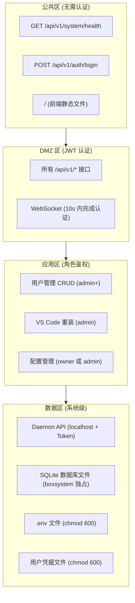

### 7.2 用户权限模型 (RBAC)

| 角色 | 权限范围 | 限制 |
|------|---------|------|
| super_admin (aiboxadmin) | 登录 Web UI、所有用户 CRUD、所有配置管理、Claude OAuth、VS Code 管理、SSH 密钥、监控和事件 | 不可删除自身 |
| admin (daemon 创建) | 登录 Web UI、开发者用户 CRUD、所有配置管理、Claude OAuth、VS Code 管理 | 不可修改管理员角色、不可删除自身 |
| programmer (管理员创建) | SSH 登录、Claude Code CLI、VS Code Remote SSH | 不可登录管理 Web UI (403) |

权限继承：super_admin > admin > programmer

### 7.3 认证机制

**JWT 认证**:
- Payload: `{userId, username, role, boxId?, iat, exp}`
- 有效期: 24h (`CONFIG.JWT_EXPIRES_IN`)
- 存储: `localStorage.jwt_token`
- 注入: `Authorization: Bearer <token>`

**Daemon API 认证**:
- Header: `X-Daemon-Token: {CONFIG.DAEMON_TOKEN}`
- IP 白名单: 127.0.0.1 / ::1 / ::ffff:127.0.0.1
- 时序安全比较: `crypto.timingSafeEqual()` 防止时间侧信道攻击

**登录三级查找链**:
1. daemon DB managed_users 表 -> admin
2. CONFIG.FACTORY_USER 出厂用户 -> super_admin
3. local DB users 表 -> programmer (返回 403)

### 7.4 进程权限最小化

**boxsystem 服务用户**:
- 不可登录 (`/usr/sbin/nologin`)
- sudoers 配置: 当前 `ALL=(ALL) NOPASSWD: ALL`（需收窄）
- 建议白名单:

```sudoers
boxsystem ALL=(ALL) NOPASSWD: /usr/sbin/useradd, /usr/sbin/userdel, /usr/sbin/usermod
boxsystem ALL=(ALL) NOPASSWD: /usr/bin/chpasswd, /usr/bin/pkill, /usr/bin/id
boxsystem ALL=(ALL) NOPASSWD: /bin/chmod, /bin/chown, /bin/mkdir, /usr/bin/tee, /bin/sed, /bin/cat, /bin/rm, /bin/mv
boxsystem ALL=(ALL) NOPASSWD: /usr/bin/bash *vscode-cc-plugin-install.sh*
boxsystem ALL=(ALL) NOPASSWD: /usr/bin/bash *generate-claude-md.sh*
boxsystem ALL=(ALL) NOPASSWD: /usr/bin/bash *generate-deploy-yaml.sh*
```

**aibox-daemon 服务用户**:
- 不可登录
- systemd: `ProtectSystem=strict`, `ProtectHome=read-only`
- 仅可写入 `/var/lib/aibox-daemon` 和 `/var/log/aibox-daemon`

### 7.5 防火墙规则建议

```bash
ufw default deny incoming
ufw default allow outgoing
ufw allow 22/tcp    comment 'SSH'
ufw allow 80/tcp    comment 'HTTP - Web UI'
ufw enable
```

---

## 8. 核心时序图

### 8.1 用户登录认证流程

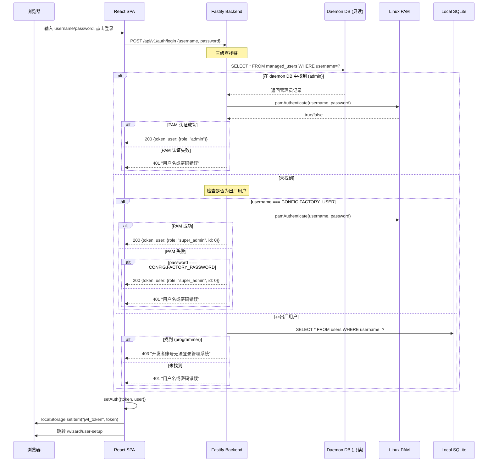

### 8.2 五步向导完整流程

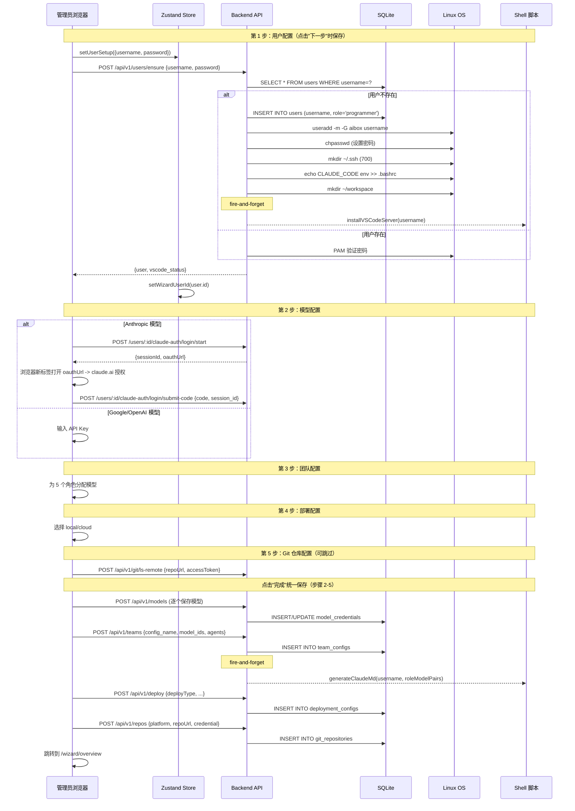

### 8.3 Claude OAuth PKCE 三方交互

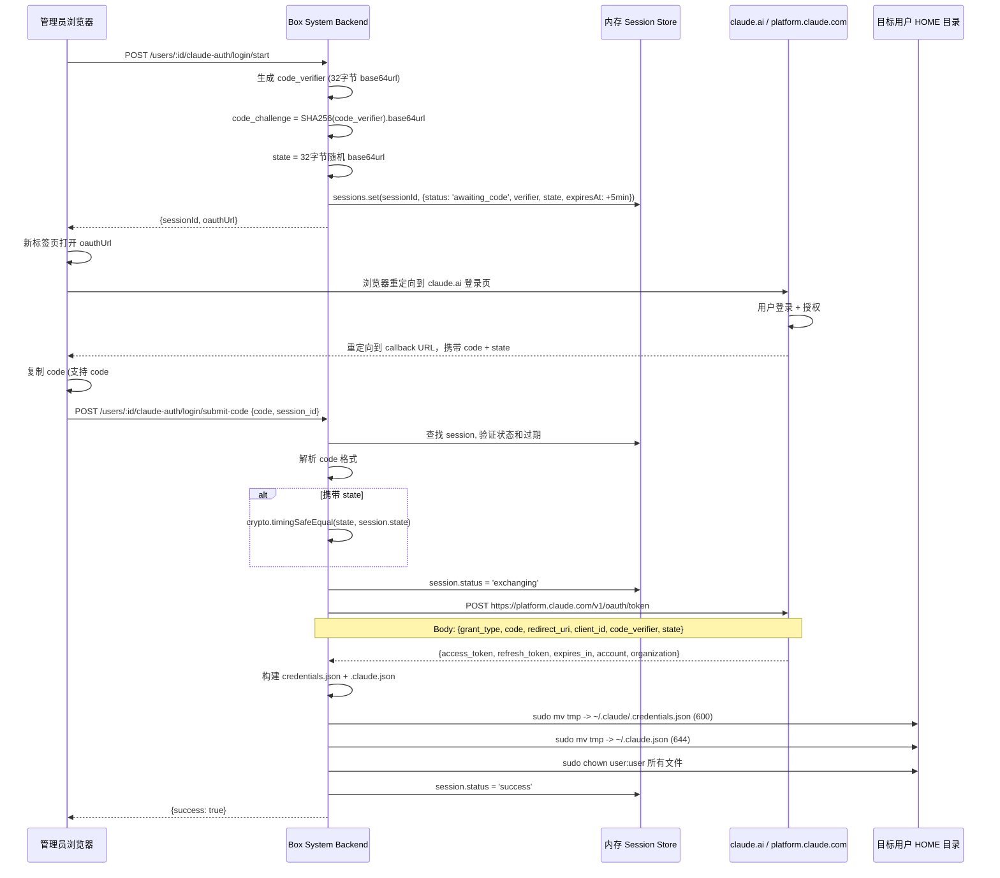

### 8.4 用户级联删除流程

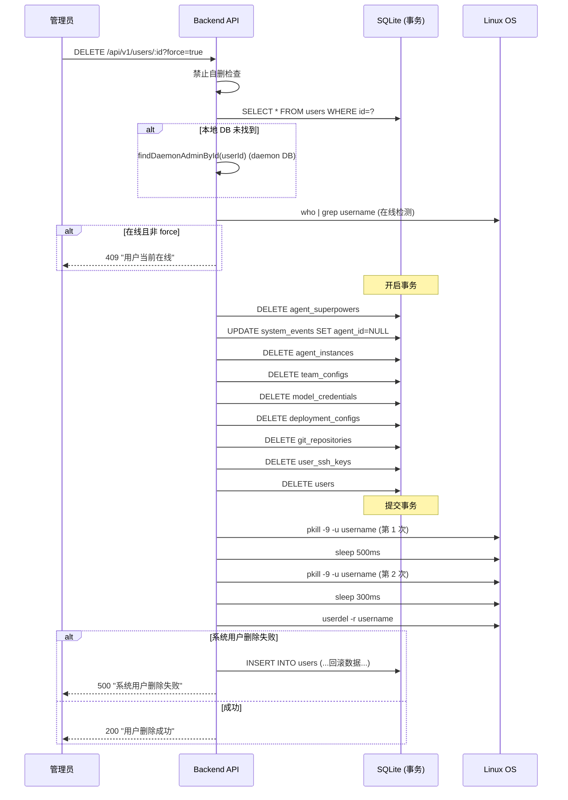

### 8.5 Agent 团队启动 + 熔断流程

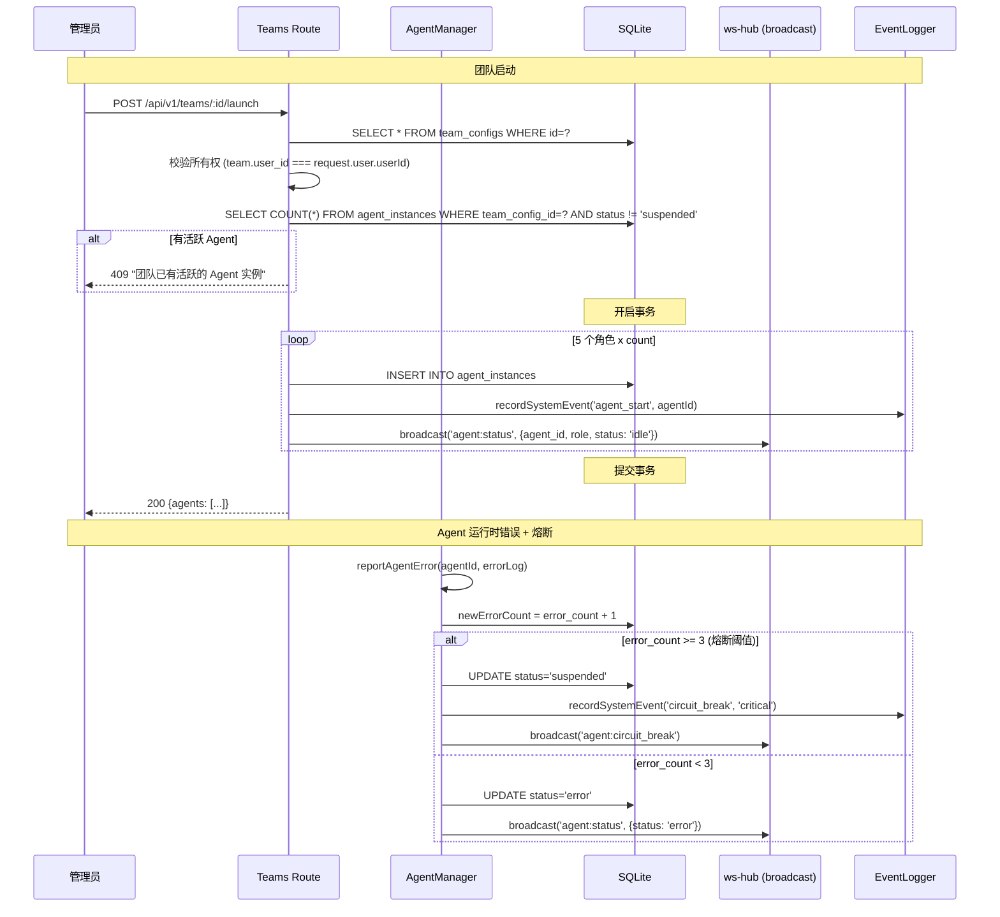

### 8.6 WebSocket 连接 + 认证流程

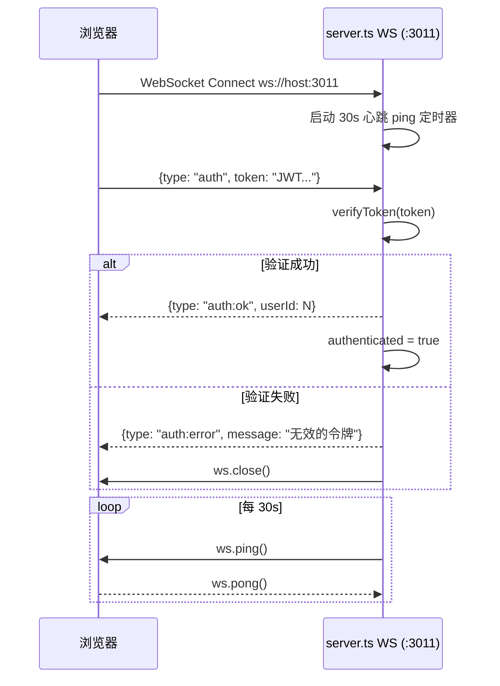

---

## 9. 状态机设计

### 9.1 Agent 实例状态机

```mermaid
stateDiagram-v2
    [*] --> idle : launch

    idle --> coding : 外部触发(开始编码)
    coding --> blocked : 资源不足/等待输入
    coding --> error : reportAgentError (count < 3)
    blocked --> idle : resume
    error --> suspended : reportAgentError (count >= 3) [熔断]

    idle --> suspended : stop (手动)
    coding --> suspended : stop (手动)
    blocked --> suspended : stop (手动)
    error --> idle : resume
    suspended --> idle : resume

    note right of suspended : 熔断阈值: error_count >= 3
```

**合法状态**: `idle | coding | blocked | error | suspended`

**状态转换触发条件**:

| 当前状态 | 目标状态 | 触发条件 | 源码 |
|----------|----------|----------|------|
| (新建) | idle | team launch | `agent-manager.ts` launchAgent() |
| idle | coding | 外部调用 updateAgentStatus() | **未实现** |
| coding | blocked | 外部调用 updateAgentStatus() | **未实现** |
| * | error | reportAgentError() 且 error_count < 3 | `agent-manager.ts` |
| * | suspended | reportAgentError() 且 error_count >= 3 | `agent-manager.ts`（熔断） |
| * | suspended | 手动 stop / daemon freeze | `agent-manager.ts` / `daemon.ts` |
| error/suspended | idle | resume | `agent-manager.ts` resumeAgent() |

### 9.2 OAuth 会话状态机

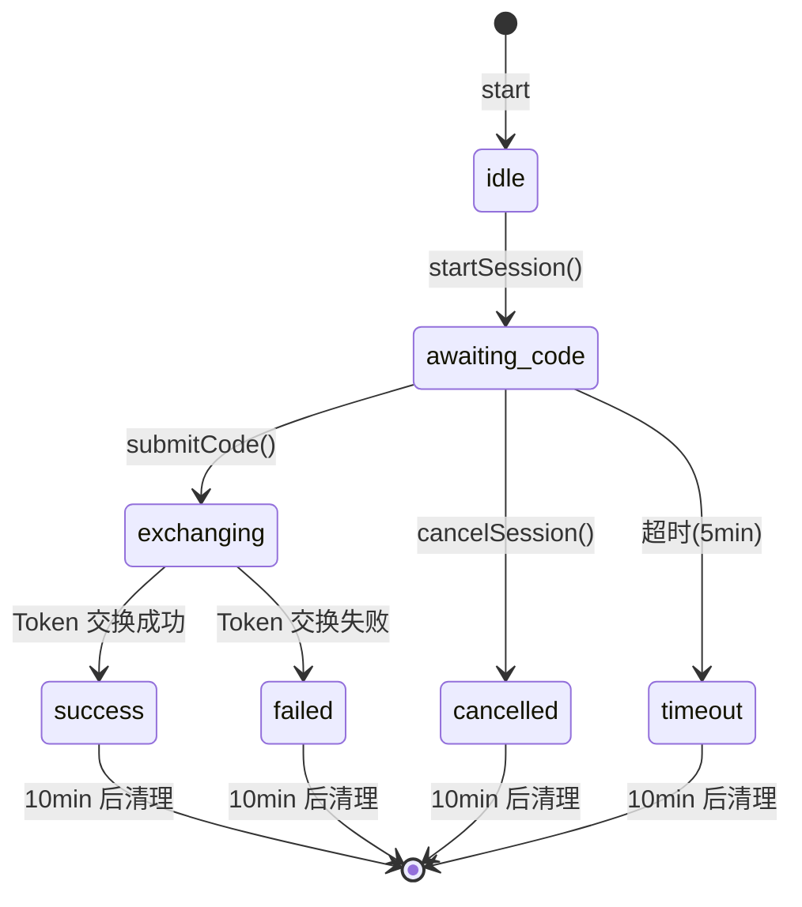

**合法状态**: `idle | awaiting_code | exchanging | success | failed | cancelled | timeout`

终态清理: 每 60 秒扫描，超过 `expiresAt + 10min` 的终态会话从 Map 中删除。

### 9.3 VS Code 安装状态机

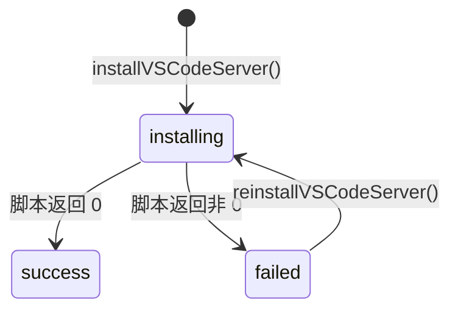

**并发控制**: `installLocks: Set<string>`（同一用户同时只能一个安装）
**存储位置**: 内存 Map（服务重启后丢失）
**前端轮询**: 5 秒间隔 `/users/:id/vscode-server/install-progress`

---

## 10. API 接口规范

### 10.1 统一响应格式（ApiEnvelope）

```typescript
interface ApiResponse<T = unknown> {
  success: boolean;    // 操作是否成功
  data?: T;            // 成功时的数据载荷
  error?: string;      // 失败时的错误描述
  message?: string;    // 人类可读消息
}
```

成功示例:
```json
{
  "success": true,
  "data": { "id": 1, "username": "dev1", "role": "programmer" },
  "message": "用户创建成功"
}
```

失败示例:
```json
{
  "success": false,
  "error": "用户名已存在"
}
```

### 10.2 HTTP 状态码

| 状态码 | 含义 | 使用场景 |
|--------|------|----------|
| 200 | 成功 | 查询、更新、删除成功 |
| 201 | 创建成功 | 新资源创建成功 |
| 400 | 参数错误 | 缺少必填字段、格式无效 |
| 401 | 未认证 | JWT 缺失/过期/无效 |
| 403 | 无权限 | programmer 登录、非管理员访问 admin 端点 |
| 404 | 不存在 | 用户/模型/团队不存在 |
| 409 | 冲突 | 用户名重复、团队已有活跃 Agent |
| 500 | 服务器错误 | 系统用户操作失败、数据库错误 |

### 10.3 分页规范

仅 system_events 和 agent logs 支持分页:

```
GET /api/v1/system/events?page=1&limit=20&event_type=agent_error&severity=error
GET /api/v1/agents/:id/logs?page=1&limit=20

响应:
{
  "success": true,
  "data": {
    "events": [...],
    "total": 150,
    "page": 1,
    "limit": 20
  }
}
```

约束: limit 最大 100，page 从 1 开始。

---

## 11. 数据流架构

### 11.1 读写路径

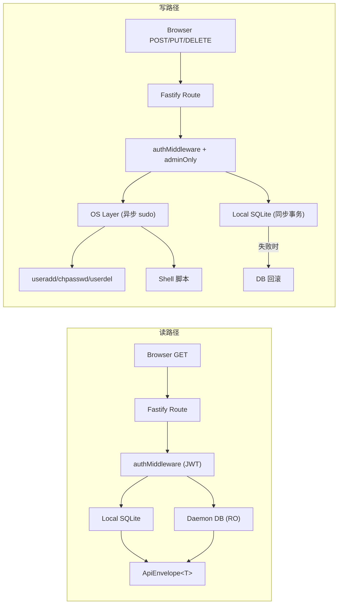

### 11.2 加密数据流

```
写入路径:
  前端明文 --POST body--> Route Handler
    --> crypto.encrypt(plaintext)
    --> base64(iv):base64(ciphertext):base64(authTag)
    --> INSERT INTO ... api_key_enc / cloud_pass_enc / auth_cred_enc
    --> SQLite 磁盘文件 (密文)

读取路径 (API 响应):
  SQLite --SELECT--> Route Handler
    --> 过滤敏感字段 (不返回 *_enc 列)
    --> ApiEnvelope<PublicType> (不含明文)

内部解密路径:
  SQLite --SELECT--> Service Layer
    --> crypto.decrypt(ciphertext)
    --> 使用明文 (deploy.yaml 生成、git ls-remote Token 注入)
```

### 11.3 Fire-and-forget 异步模式

| 触发点 | 异步操作 | 源码位置 |
|--------|----------|----------|
| 用户创建/ensure | `installVSCodeServer(username)` | `routes/users.ts` L171-L181 |
| 团队创建/更新 | `generateClaudeMd(username, roleModelPairs)` | `routes/teams.ts` |
| 部署配置创建（cloud） | `generateDeployYaml(username, envSpecs, gitSpec)` | `routes/deploy.ts` |

异步操作特点:
- HTTP 响应在异步操作开始前即返回
- 成功/失败通过 `recordSystemEvent()` 记录
- 错误通过 `log.error()` 记录到日志
- 前端通过轮询或刷新获知结果

---

## 12. 资源规划

### 12.1 硬件基线

| 档位 | 用户数 | CPU | 内存 | 磁盘 | 适用场景 |
|------|-------|-----|------|------|---------|
| 入门 | 10 用户 | 4 核 | 8 GB | 128 GB SSD | 小型开发团队 |
| 标准 | 25 用户 | 8 核 | 16 GB | 256 GB SSD | 中型开发团队 |
| 扩展 | 50 用户 | 8 核 | 32 GB | 512 GB SSD | 大型开发团队 |

### 12.2 内存分配模型

| 组件 | 内存占用 | 说明 |
|------|---------|------|
| 操作系统 + 系统服务 | ~1.5 GB (固定) | Linux 内核 + sshd + 其他 |
| Box System (Node.js) | ~200-500 MB | V8 堆 + SQLite 缓存 + WS + OAuth |
| Nginx | ~50 MB | |
| aibox-daemon | ~50-256 MB (有上限) | MemoryMax=256M |
| VS Code Server (每用户) | ~200-500 MB x N | 25 用户: 5-12.5 GB |
| Claude Code CLI (每用户) | ~100-300 MB x N | 25 用户: 2.5-7.5 GB |
| 开发者进程 | 变动大 | 编译/调试 |

### 12.3 磁盘空间规划（25 用户）

| 用途 | 路径 | 估算 |
|------|------|------|
| Box System 应用 | `/opt/aibox/box-system/` | ~200 MB |
| VS Code Server 资源 | `/opt/aibox/vscode-server/` | ~100 MB |
| SQLite 数据库 | `data/swt.db` | ~10-50 MB |
| 应用日志 | `data/logs/app.log` | ~100 MB |
| 用户 HOME (每用户) | `/home/<user>/` | ~1-5 GB |
| **合计 (25 用户)** | | **~30-130 GB** |

### 12.4 内存保护机制

| 阈值 | 级别 | 动作 |
|------|------|------|
| >85% | WARN | 广播告警 `system:alert` |
| >95% | CRITICAL | 自动挂起非核心 Agent（保留 architect 角色） |

---

## 13. 可靠性设计

### 13.1 故障恢复矩阵

| 故障场景 | 检测方式 | 自动恢复 | RTO | 数据影响 |
|---------|---------|---------|-----|---------|
| Box System 进程崩溃 | systemd | Restart=on-failure, 5s | ~10s | 内存状态丢失 |
| aibox-daemon 崩溃 | systemd | Restart=always, 5s | ~15s | 未完成指令从本地 DB 恢复 |
| Nginx 崩溃 | systemd | 自动重启 | ~5s | 前端暂时不可访问 |
| SQLite 损坏 | 启动失败 | 需手动恢复备份 | 取决于备份 | 最近备份以来数据丢失 |
| 网络断开 | daemon.ts DNS 探测 | 广播告警 + Agent 冻结 | 网络恢复后 | 无数据丢失 |
| 内存不足 (>95%) | daemon.ts 资源监控 | 自动挂起 Agent | 即时 | 无数据丢失 |
| VS Code 安装失败 | 脚本返回错误码 | 记录事件，前端显示重试 | 手动重试 | 无影响 |
| OAuth Token 过期 | CLI 检测 | 管理员重新认证 | 手动 | 凭据需重写 |

### 13.2 单点故障分析

| 组件 | 是否单点 | 缓解措施 |
|------|---------|---------|
| Node.js 进程 | 是 | systemd 自动重启 |
| SQLite 文件 | 是 | 定期备份 |
| Nginx | 是 | systemd 自动重启（3010 直连仍可用） |
| 物理磁盘 | 是 | 定期离线备份 |

**设计认知**: 单机系统所有组件天然单点。目标不是消除单点，而是最小化恢复时间和数据损失。

### 13.3 数据备份策略

| 指标 | 目标 |
|------|------|
| RPO | 24 小时 |
| RTO | 15 分钟 |
| 备份方式 | SQLite `.backup` API 或文件复制 |
| 备份频率 | 每日凌晨 2:00 |
| 保留策略 | 最近 7 份 |

### 13.4 优雅关闭流程

```
SIGINT/SIGTERM
  -> 1. 关闭 WebSocket Server (wss.close())
  -> 2. 关闭 Box System SQLite 连接 (WAL checkpoint)
  -> 3. 关闭 Daemon DB 只读连接
  -> 4. 关闭 Fastify HTTP 服务器 (等待请求完成)
  -> 5. process.exit(0)
```

---

## 14. 运维设计

### 14.1 部署流程

#### 离线打包部署（推荐）

```
开发机:
  1. cd deploy && bash pack.sh
     生成 aibox-box-system-YYYYMMDD.tar.gz

  2. scp *.tar.gz user@box-ip:/tmp/

目标机器 (AI-BOX):
  3. tar xzf *.tar.gz
  4. cd aibox-box-system
  5. sudo bash install.sh

install.sh 10 步:
  1. 环境检查 (x86_64 + Ubuntu 22.04+)
  2. 系统依赖 (gcc, python3, libpam0g-dev...)
  3. Node.js 20 LTS
  4. pnpm
  5. 用户组 (aibox, aibox-admin, boxsystem)
  6. sudoers 配置
  7. 文件部署到 /opt/aibox/
  8. pnpm install + pnpm build
  9. .env 生成 (JWT_SECRET 随机)
  10. systemd 服务注册 + 启动
```

### 14.2 升级/回滚

```bash
# 升级
cp data/swt.db data/swt.db.pre-upgrade-$(date +%Y%m%d)
cp src/backend/.env src/backend/.env.backup
sudo systemctl stop aibox-box-system
rsync -a --delete --exclude='node_modules' --exclude='data/' --exclude='.env' --exclude='dist/' new-version/ /opt/aibox/box-system/
cd /opt/aibox/box-system && pnpm install --frozen-lockfile && pnpm build
chown -R boxsystem:boxsystem /opt/aibox/box-system
sudo systemctl start aibox-box-system
curl http://localhost:3010/api/v1/system/health

# 回滚
sudo systemctl stop aibox-box-system
cp data/swt.db.pre-upgrade-* data/swt.db
sudo systemctl start aibox-box-system
```

### 14.3 日志轮转配置

```
# /etc/logrotate.d/aibox-box-system
/opt/aibox/box-system/src/backend/data/logs/app.log {
    daily
    missingok
    rotate 14
    compress
    delaycompress
    notifempty
    copytruncate
    maxsize 100M
}
```

### 14.4 监控告警

| 监控项 | 采集间隔 | 告警阈值 | 告警动作 |
|-------|---------|---------|---------|
| CPU 使用率 | 10s | 无阈值 | 仅记录 |
| 内存使用率 | 10s | >85% WARN, >95% CRITICAL | CRITICAL 挂起非核心 Agent |
| 磁盘使用率 | 10s | **当前 Mock** | 无 |
| 网络连通性 | 30s | DNS 失败 | 广播告警 |
| Agent 心跳 | 15s | >60s 无响应 | 标记 error |

外部监控接入:
```bash
# 健康检查
curl -s http://localhost:3010/api/v1/system/health

# 资源使用
curl -s -H "Authorization: Bearer <JWT>" http://localhost:3010/api/v1/system/resources
```

### 14.5 运维命令速查表

```bash
# 服务管理
sudo systemctl start|stop|restart|status aibox-box-system
sudo systemctl enable aibox-box-system

# 日志查看
sudo journalctl -u aibox-box-system -f
sudo journalctl -u aibox-box-system -n 100
sudo journalctl -u aibox-box-system --since today

# 健康检查
curl -s http://localhost:3010/api/v1/system/health | python3 -m json.tool

# 数据库
sqlite3 -readonly /opt/aibox/box-system/src/backend/data/swt.db
sqlite3 data/swt.db "SELECT id, username, role FROM users;"
sqlite3 data/swt.db ".backup '/tmp/swt_backup.db'"

# 用户排查
id <username>
who | grep <username>
sudo ls -la /home/<username>/.claude/
sudo ls /home/<username>/.vscode-server/

# 网络排查
sudo ss -tlnp | grep -E '3010|3011|80|22'
curl -v https://platform.claude.com/v1/oauth/token 2>&1 | head -20

# 磁盘清理
df -h /opt/aibox/
du -sh /opt/aibox/box-system/src/backend/data/
```

---

## 15. 已知问题与改进计划

### 15.1 双 WebSocket 实现冲突 [P0]

**问题**: server.ts 内联 WS (:3011) 实际运行，ws-hub.ts 模块化 WS 未初始化。

**影响**: agent-manager、daemon、llm-gateway 的 `broadcast()` 调用遍历空 Map，Agent 状态变更/熔断告警/资源告警无法推送前端。

**修复方案**: 在 server.ts 中调用 `createWsHub(httpServer)` 替代内联 WS，或将 ws-hub 绑定到 CONFIG.WS_PORT。

### 15.2 Root Daemon 未启动 [P0]

**问题**: `daemon.ts` 的 `startDaemon()` 从未在 server.ts 中被调用。

**影响**: 资源监控(10s)、心跳检测(15s)、网络检测(30s)、内存保护(>95%自动挂起)全部不工作。

**修复方案**: server.ts bootstrap 中调用 `startDaemon()`，shutdown 中调用 `stopDaemon()`。

### 15.3 用户名校验双层不一致 [P1]

**问题**: API 层允许 3-50 字符，系统层正则限制 3-32 字符。

**修复方案**: 统一为 `/^[a-z_][a-z0-9_-]{2,31}$/`（3-32 字符）。

### 15.4 Daemon route 级联删除不完整 [P1]

**问题**: daemon.ts DELETE 端点仅执行 `DELETE FROM users WHERE username=?`，不级联删除关联表。

**修复方案**: 复用 users route 的级联删除逻辑。

### 15.5 内存状态重启丢失 [P2]

**问题**: OAuth 会话、安装进度等内存数据重启后丢失。

**缓解**: OAuth 5min 超时 + 60s 清理已足够；安装脚本由 OS 进程独立执行不受影响。

### 15.6 磁盘监控 Mock [P1]

**问题**: daemon.ts 中磁盘使用率固定返回 50%。

**修复方案**: 使用 `df` 命令或 `statvfs` 系统调用获取真实数据。

---

## 16. 扩展设计（多 Box 联邦）

### 16.1 演进路线

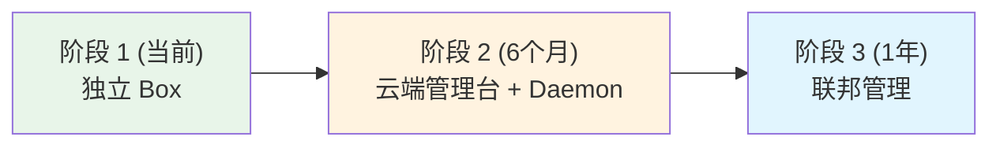

**阶段 1**: 每台 Box 独立运行，各自管理用户和配置。

**阶段 2**: 云端管理台通过 aibox-daemon WS 长连接下发指令，Box System 通过 `/api/v1/daemon/*` 接收执行。

**阶段 3**: 云端提供统一面板、批量操作、配额汇总。每台 Box 仍独立运行，云端提供"联邦视图"。

### 16.2 数据同步策略

- **配置下发**: 云端持有"期望状态"，通过 daemon 指令下发
- **状态上报**: Box 通过 daemon 心跳上报"实际状态"
- **冲突解决**: 云端配置变更优先（cloud is source of truth）
- **不做**: Box 之间不同步数据

---

## 17. 架构决策记录（ADR）

### ADR-001: SQLite 作为唯一数据库

| 维度 | 内容 |
|------|------|
| 背景 | 企业内网物理设备，运维人员非 DBA |
| 决策 | SQLite (better-sqlite3) + WAL |
| 理由 | 零运维、单文件备份、同步 API、50 用户 + 1 年约 50MB |
| 否决 | PostgreSQL(运维重)、LevelDB(无SQL)、JSON文件(无事务) |

### ADR-002: PAM 统一认证

| 维度 | 内容 |
|------|------|
| 背景 | 系统用户需与 Linux 用户同步 |
| 决策 | Linux PAM 认证，DB 不存密码 |
| 理由 | 密码统一、无泄露风险、支持 PAM 生态 |
| 否决 | bcrypt(双重密码)、LDAP(外部依赖) |

### ADR-003: Nginx 反向代理

| 维度 | 内容 |
|------|------|
| 背景 | 3 个网络端点需统一暴露 |
| 决策 | Nginx :80 统一入口 |
| 理由 | 端口统一、SPA 回退、WS 保活、HTTPS 就绪 |
| 否决 | Fastify 直暴(失运维优势)、Caddy(非标准) |

### ADR-004: 单机一体化部署

| 维度 | 内容 |
|------|------|
| 背景 | 企业级产品是否需分布式架构 |
| 决策 | 单机一体化 |
| 理由 | 10-50 用户足够、运维简单、故障域简单、数据一致 |
| 否决 | Docker Compose(增加复杂度)、K8s(过度设计) |

### ADR-005: AES-256-GCM 加密

| 维度 | 内容 |
|------|------|
| 背景 | 需加密存储 API Key/密码/私钥 |
| 决策 | AES-256-GCM + 环境变量主密钥 |
| 理由 | 简单可靠、认证加密、无需 PKI |
| 风险 | 主密钥与数据同机（单机固有限制） |

### ADR-006: WebSocket 独立端口

| 维度 | 内容 |
|------|------|
| 背景 | Fastify 5 与 ws 集成复杂 |
| 决策 | WS 独立端口 :3011 |
| 理由 | 架构简洁、独立配置防火墙、调试方便 |
| 代价 | Nginx 需额外 WS 代理配置 |

### ADR-007: Fire-and-forget 异步

| 维度 | 内容 |
|------|------|
| 背景 | VS Code 安装(2min)等不应阻塞响应 |
| 决策 | Promise.then().catch() |
| 理由 | 无需 Redis、结果通过事件表记录 |
| 代价 | 异步失败无即时反馈 |

### ADR-008: HTTP REST 进程间通信

| 维度 | 内容 |
|------|------|
| 背景 | Node.js 与 Go 进程需通信 |
| 决策 | 本地 HTTP + Token |
| 理由 | 标准化、松耦合、curl 可测 |
| 否决 | UDS(不便调试)、gRPC(Proto 管理)、共享 DB(破坏隔离) |

### ADR-009: pino 多流日志

| 维度 | 内容 |
|------|------|
| 背景 | 需结构化日志 |
| 决策 | pino stdout + 文件 |
| 理由 | 性能最优、双重输出、JSON 结构化 |
| 改进 | 需配置 logrotate |

### ADR-010: pnpm workspace monorepo

| 维度 | 内容 |
|------|------|
| 背景 | 前后端同仓库 |
| 决策 | pnpm workspace |
| 理由 | 硬链接节省空间、跨包引用、统一构建 |

### ADR-011: 系统用户双写 (DB先+OS后+回滚)

| 维度 | 内容 |
|------|------|
| 背景 | 应用用户需同步到 Linux 系统用户 |
| 决策 | DB 先写 + OS 后写 + 失败回滚 |
| 理由 | DB 操作确定性高、OS 操作可能失败、回滚保证一致性 |

### ADR-012: OAuth PKCE 手动授权码

| 维度 | 内容 |
|------|------|
| 背景 | 内网 Box 无公网回调 URL |
| 决策 | 管理员手动复制授权码 |
| 理由 | 物理限制、PKCE 保证安全、支持 3 种格式 |
| 改进 | 前端需提供清晰操作引导 |

---

## 18. 附录

### 18.1 完整服务文件索引

| 服务文件 | 路径 | 行数 | 核心职责 |
|----------|------|------|----------|
| server.ts | `src/backend/src/server.ts` | 158 | 应用入口 |
| config.ts | `src/backend/src/services/config.ts` | 61 | 环境变量配置 |
| connection.ts | `src/backend/src/db/connection.ts` | 59 | SQLite 连接 |
| schema.sql | `src/backend/src/db/schema.sql` | 156 | 表结构 DDL |
| migrate.ts | `src/backend/src/db/migrate.ts` | 136 | 迁移系统 |
| auth.ts (middleware) | `src/backend/src/middleware/auth.ts` | 147 | JWT/RBAC/Daemon 认证 |
| auth.ts (route) | `src/backend/src/routes/auth.ts` | ~100 | 登录/刷新端点 |
| users.ts | `src/backend/src/routes/users.ts` | 649 | 用户 CRUD + 级联删除 |
| models.ts | `src/backend/src/routes/models.ts` | ~200 | 模型凭据 CRUD |
| teams.ts | `src/backend/src/routes/teams.ts` | ~300 | 团队配置 CRUD |
| deploy.ts | `src/backend/src/routes/deploy.ts` | ~200 | 部署配置 CRUD |
| repos.ts | `src/backend/src/routes/repos.ts` | ~200 | Git 仓库 CRUD |
| agents.ts | `src/backend/src/routes/agents.ts` | ~200 | Agent 管理 |
| system.ts | `src/backend/src/routes/system.ts` | ~100 | 健康/资源/事件 |
| daemon.ts (route) | `src/backend/src/routes/daemon.ts` | 403 | Daemon 内部 API |
| claude-auth.ts (route) | `src/backend/src/routes/claude-auth.ts` | ~150 | OAuth PKCE 端点 |
| vscode-server.ts (route) | `src/backend/src/routes/vscode-server.ts` | ~100 | VS Code 管理 |
| user-ssh-keys.ts | `src/backend/src/routes/user-ssh-keys.ts` | ~150 | SSH 公钥 |
| ssh.ts | `src/backend/src/routes/ssh.ts` | ~200 | 系统级 SSH |
| git.ts | `src/backend/src/routes/git.ts` | ~150 | git ls-remote |
| pam-auth.ts | `src/backend/src/services/pam-auth.ts` | 74 | PAM 认证 |
| system-user.ts | `src/backend/src/services/system-user.ts` | 248 | Linux 用户管理 |
| crypto.ts | `src/backend/src/services/crypto.ts` | 81 | AES-256-GCM |
| claude-auth.ts (service) | `src/backend/src/services/claude-auth.ts` | 453 | OAuth PKCE 会话 |
| vscode-server.ts (service) | `src/backend/src/services/vscode-server.ts` | 262 | VS Code 安装 |
| agent-manager.ts | `src/backend/src/services/agent-manager.ts` | 314 | Agent 生命周期 |
| llm-gateway.ts | `src/backend/src/services/llm-gateway.ts` | 297 | LLM 请求网关 |
| daemon.ts (service) | `src/backend/src/services/daemon.ts` | 453 | Root Daemon |
| ws-hub.ts | `src/backend/src/services/ws-hub.ts` | 347 | WebSocket Hub |
| event-logger.ts | `src/backend/src/services/event-logger.ts` | 38 | 系统事件记录 |
| daemon-db.ts | `src/backend/src/services/daemon-db.ts` | 174 | Daemon DB 只读 |
| claude-md-generator.ts | `src/backend/src/services/claude-md-generator.ts` | 138 | CLAUDE.md 生成 |
| deploy-yaml-generator.ts | `src/backend/src/services/deploy-yaml-generator.ts` | 128 | deploy.yaml 生成 |
| logger.ts | `src/backend/src/services/logger.ts` | 97 | pino 日志 |

### 18.2 环境变量配置清单

| 变量名 | 默认值 | 必需 | 说明 |
|--------|--------|------|------|
| `PORT` | 3010 | 否 | HTTP 端口 |
| `HOST` | 0.0.0.0 | 否 | 监听地址 |
| `WS_PORT` | 3011 | 否 | WebSocket 端口 |
| `NODE_ENV` | development | 否 | 运行环境 |
| `JWT_SECRET` | (随机生成) | 是 | JWT 签名密钥 |
| `JWT_EXPIRES_IN` | 24h | 否 | JWT 有效期 |
| `SWT_MASTER_KEY` | (dev-default) | 生产必需 | AES-256 主密钥 (64 hex) |
| `DB_PATH` | ./data/swt.db | 否 | SQLite 路径 |
| `DAEMON_DB_PATH` | /var/lib/aibox-daemon/aibox.db | 否 | Daemon DB 路径 |
| `DAEMON_TOKEN` | (默认值) | 生产必需 | Daemon API Token |
| `FACTORY_USER` | aiboxadmin | 否 | 出厂管理员用户名 |
| `FACTORY_PASSWORD` | changeme123 | 否 | 出厂管理员密码 |
| `LINUX_USER_ENABLED` | true | 否 | 是否启用 Linux 用户操作 |
| `LOG_LEVEL` | info | 否 | 日志级别 |
| `CLAUDE_OAUTH_CLIENT_ID` | (内置) | 否 | OAuth Client ID |

### 18.3 前端架构概要

```
src/frontend/src/
  App.tsx                     # 根路由: / -> /login, /wizard/* (嵌套)
  layouts/WizardLayout.tsx    # 向导布局: 侧导航 + 步骤条 + Outlet
  pages/
    Login.tsx                 # 登录页
    UserSetup.tsx             # 第 1 步: 用户配置
    ModelConfig.tsx           # 第 2 步: 模型配置 + OAuth
    TeamConfig.tsx            # 第 3 步: 团队编排
    DeployConfig.tsx          # 第 4 步: 部署配置
    RepoConfig.tsx            # 第 5 步: Git 仓库
    Overview.tsx              # 账号概览
  store/
    wizardStore.ts            # Zustand: 向导表单 + 认证状态(localStorage)
    adminStore.ts             # Zustand: Box 列表(预留)
  services/
    api.ts                    # fetch 封装: JWT 注入, ApiEnvelope 解包
  components/m3/              # Material Design 3 风格组件库
```

状态持久化:
- JWT Token -> `localStorage.jwt_token`
- 用户 ID -> `localStorage.user_id`
- 向导表单数据 -> **不持久化**（刷新丢失）

### 18.4 端口与进程总览

| 端口 | 进程 | 说明 | 配置项 |
|------|------|------|--------|
| 80 | Nginx | 反向代理入口（生产） | nginx.conf |
| 3010 | Node.js (Fastify) | HTTP API + 静态文件 | `CONFIG.PORT` |
| 3011 | Node.js (ws) | WebSocket | `CONFIG.WS_PORT` |
| 22 | sshd | SSH | system |
| 5181 | Vite | 前端开发服务器（仅开发） | vite.config.ts |

---

> **文档变更记录**
>
> | 版本 | 日期 | 变更内容 |
> |------|------|---------|
> | 1.0.0 | 2026-03-10 | 初始版本，合并 Arch1 逻辑架构 + Arch2 物理架构，经四角色评审 |
